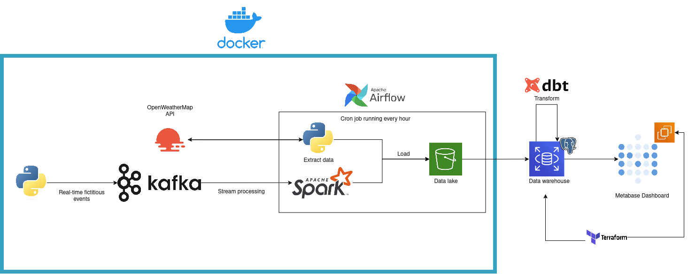
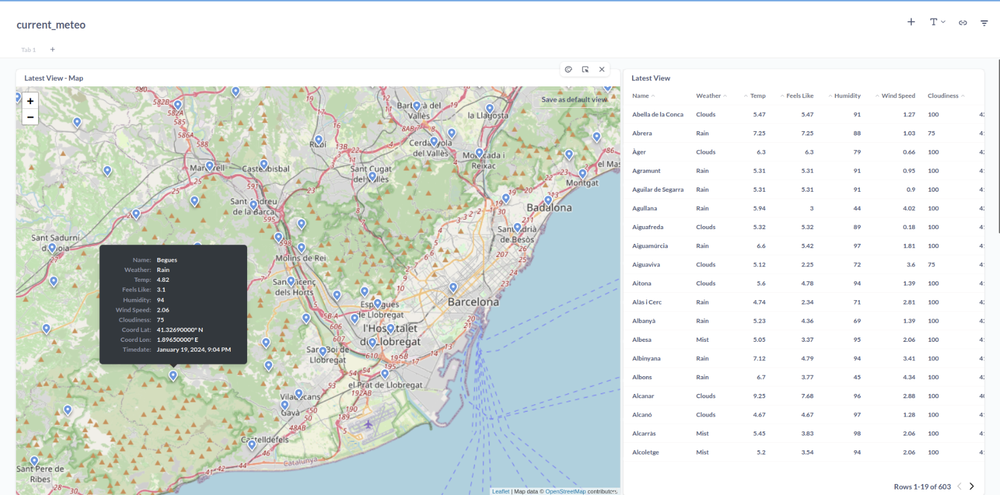

## Description

### Objective
This project aims to display both present and past data from towns in Catalonia. Additionally, it will generate fake data to be sent through Kafka, allowing for unlimited data transmission without concerns about API limits.

I approached the project more from a learning experience, rather than a practical one. The objective of this project is to implement various technologies to gain an understanding of how they work and the advantages and disadvantages of each one.

### Dataset

[OpenWeatherMap](https://openweathermap.org/) is an API which collects meteorological data ffrom around the globe, and [Generalitat de Catalunya](https://analisi.transparenciacatalunya.cat/), a public data collection of the government of catalonia.
[Made up Data] Python script

### Tools & Technologies

- Cloud - [**Amazon Web Services**](https://aws.amazon.com/)
- Infrastructure as Code software - [**Terraform**](https://www.terraform.io)
- Orchestration - [**Airflow**](https://airflow.apache.org)
- Streaming processing - [**Kafka**](https://kafka.apache.org/), [**SparkStreaming**](https://spark.apache.org/)
- Transformation - [**dbt**](https://www.getdbt.com)
- Data Lake - [**Amazon S3**](https://aws.amazon.com/es/s3/)
- Data Warehouse - [**Amazon RDS (PostgreSQL)**](https://aws.amazon.com/free/database/)
- Data Visualization - [**Metabase**](https://www.metabase.com/)
- Language - [**Python**](https://www.python.org)

### Architecture

### Pre-requisites

- Amazon Web Services account
- OpenWeatherMap API account

## Setup

 - [Setup](https://github.com/FontJordi/meteo/blob/master/dags/notes_on_airflow.txt) Airflow
 - [Setup](https://github.com/FontJordi/meteo/blob/master/dbt/notes_on_dbt.txt) dbt envoirment 
 - [Setup](https://github.com/FontJordi/meteo/blob/master/kafka/notes_on_kafka.txt) Kafka
 - [Setup](https://github.com/FontJordi/meteo/blob/master/terraform/notes_on_terraform.txt) Terraform 
 - [Setup](https://github.com/FontJordi/meteo/blob/master/metabase/notes_on_metabase.txt) Metabase 

## Final Result

