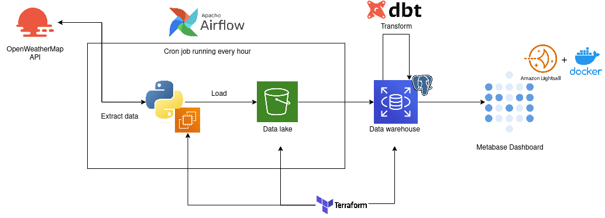

## Description

### Objective
This project will show current and historical from towns in Catalonia.

### Dataset

[OpenWeatherMap](https://openweathermap.org/) is an API which collects meteorological data ffrom around the globe, and [GeneralitatdeCatalunya]https://analisi.transparenciacatalunya.cat/, a public data collection of the government of catalonia.

### Tools & Technologies

- Cloud - [**Amazon Web Services**](https://aws.amazon.com/)
- Infrastructure as Code software - [**Terraform**](https://www.terraform.io)
- Orchestration - [**Airflow**](https://airflow.apache.org)
- Transformation - [**dbt**](https://www.getdbt.com)
- Data Lake - [**Amazon S3**](https://aws.amazon.com/es/s3/)
- Data Warehouse - [**Amazon RDS (PostgreSQL)**](https://cloud.google.com/bigquery)
- Data Visualization - [**Metabase**](https://www.metabase.com/)
- Language - [**Python**](https://www.python.org)

### Architecture

### Pre-requisites

- Amazon Web Services account

## Setup

 -Setup Airflow
 -Setup dbt envoirment
 -Launch terraform template

notes: current etl working. have to work on:

imports on scrpit.py
upload terraform to github
upload airflow dags
dockerize everything
code airflow connections and rds permissions to access bucket (maybe user too?) assign role to rds.

How to use:

city.list.json is a downloaded json file from openweaterapi containing all the cities available

there has to be a folder keys with an api.txt file containing you openweatherapi key

in DATA/ there has to be csv files where the first column has the name of the cities you want to take into account

change airflow path to script.py

airflow standalone / airflow migrate db / pro envoirment of airflow. configure connections to postgres and aws there

